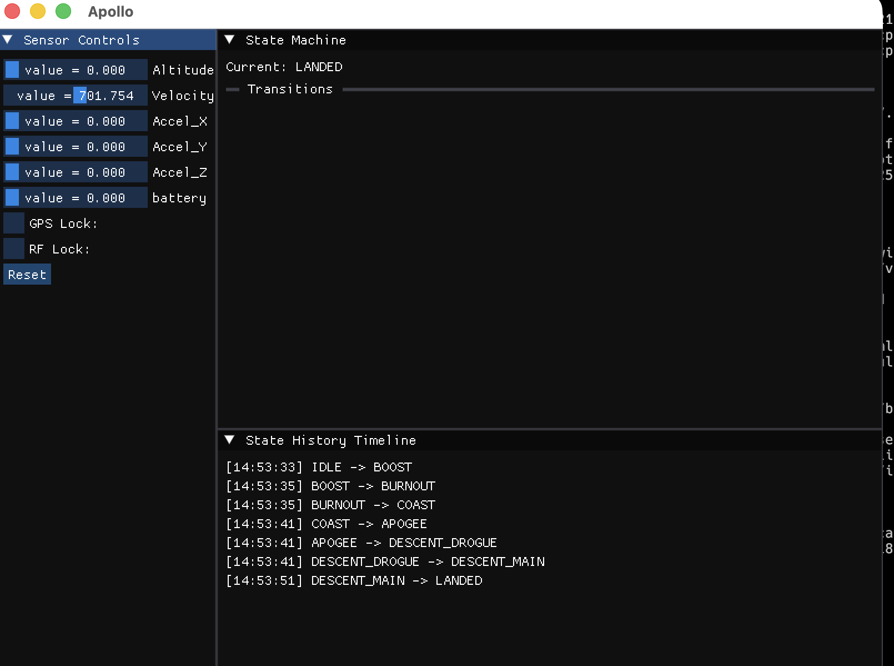

# apollo

## Instructions

in order to build/run the project here are the steps:

1. create `build/` dir using cmake
2. copy `compile_commands.json` from `build/` to root dir `(ie. apollo/)`
3. run `cmake --build apollo/build/` to create exectuable

in `apollo/` root dir run the command

```bash
cmake -B apollo/build/
```

then move `.json` file fro `build/` to `apollo/` root:

```bash
ln -s apollo/build/compile_commands.json .
```

create the project executable:

```bash
cmake --build apollo/build/
```

run the application in project root:

```bash
./apollo/build/apollo
```

## CURRENT UPDATE


March Update of GUI progress and logic
## plan

### GUI

```bash
┌─────────────────┬──────────────────────┐
│ State Machine   │ Sensor Controls      │
│ ┌─────────────┐ │ Altitude: [====│   ] │
│ │ Current:    │ │ Velocity: [══│     ] │
│ │ BOOST       │ │ Accel X:  [   │====] │
│ │             │ │ Accel Y:  [     │==] │
│ └─────────────┘ │ Accel Z:  [====│   ] │
│ Transitions:    │ GPS Lock: [X]        │
│ • BOOST→COAST   │ LoRa:     [X]        │
│   when vel<0    │ Battery:  [====│   ] │
│ • COAST→APOGEE  │                      │
│   when alt max  │ [Inject Fault ▼]     │
├─────────────────┴──────────────────────┤
│ State History Timeline                 │
│ ████BOOST██COAST████APOGEE███DESCENT   │
│ 0s────5s────10s────15s────20s          │
├────────────────────────────────────────┤
│ Real-time Plots                        │
│ [Altitude, Velocity, Acceleration]     │
└────────────────────────────────────────┘
```
